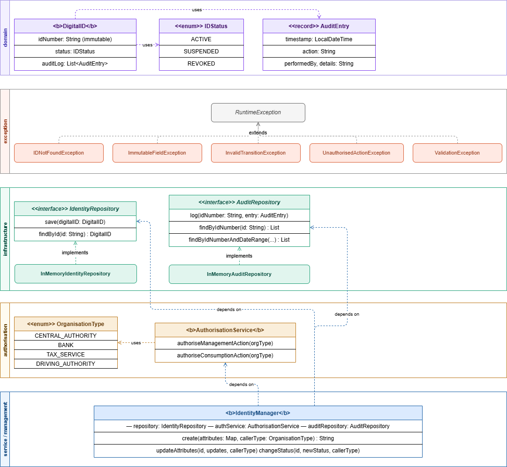

# IOT452U — Digital ID Management System

## Section 1: Project Overview

This project implements a Digital ID Management System. The system manages the full lifecycle of citizen digital 
identities: creation, attribute updates, status transitions, and permanent revocation. It also provides a 
verification layer for consuming organisations: banks, employers, tax authorities, and driving licence authorities, 
which each can query identity validity according to rules specific to their role.

The system is implemented in Java using a Layered Architecture with strict package-level separation. The management capability (writing) and the consumption capability (reading) are structurally isolated into separate sub-packages within the service layer, meaning neither can accidentally import the other. All dependencies are injected through constructors, all storage is abstracted behind repository interfaces, and the domain object enforces its own business rules including a state machine for status transitions.

## Section 2: System Architecture

### Layered Architecture
The system uses a Layered Architecture. Each package has a single responsibility, and the dependency rule is enforced strictly: higher layers depend on lower layers, never the reverse.

```
presentation/     →  Main.java (wires everything together, runs demo scenarios)
service/
    management/   →  IdentityManager (create, update, change status)
    consumption/  →  VerificationService + one portal per organisation type
domain/           →  DigitalID, IDStatus, AuditEntry
infrastructure/   →  IdentityRepository, AuditRepository (interfaces + in-memory implementations)
authorisation/    →  AuthorisationService, OrganisationType
exception/        →  IDNotFoundException, InvalidTransitionException, ImmutableFieldException, UnauthorisedActionException, ValidationException
```

### Class Diagram



The `management` and `consumption` sub-packages are strictly separated, with neither importing the other. `Main.java` is the only place in the codebase where both sides are connected, using shared repository instances. This separation is structurally enforced, meaning it can be verified simply by confirming that no cross-package imports exist.

Each organisation type has its own portal class in the consumption sub-package, exposing only the verification method appropriate to its role:

| Portal               | Organisation Type | Verification Type                          |
|----------------------|-------------------|--------------------------------------------|
| BankPortal           | BANK              | Basic (ACTIVE/INVALID)                     |
| EmployerPortal       | EMPLOYER          | Basic (ACTIVE/INVALID)                     |
| TaxAuthorityPortal   | TAX_SERVICE       | Historical (period-based suspension check) |
| DrivingLicencePortal | DRIVING_AUTHORITY | Eligibility (ACTIVE + no restrictions)     |


## Section 3: Design Patterns

### Repository Pattern (Fowler, 2002)
`IdentityManager` and `VerificationService` depend on the `IdentityRepository` and `AuditRepository` interfaces, not on the concrete `InMemory` implementations. The backing store can be swapped by changing one line in `Main.java` without touching any service code.

### Facade Pattern (Gamma et al., 1994)
Each organisation type gets its own portal class that exposes only the verification method it needs. A `BankPortal` cannot call a tax history query because that method does not exist on `BankPortal`.

### State Pattern (Gamma et al., 1994)
`DigitalID.transitionStatus()` enforces which status transitions are legal. ACTIVE → SUSPENDED or REVOKED; SUSPENDED → ACTIVE or REVOKED; REVOKED → nothing. Invalid transitions throw `InvalidTransitionException`. 

### Dependency Injection (Fowler, 2004)
- All dependencies are passed through constructors. `IdentityManager` receives `IdentityRepository`, `AuthorisationService`, and `AuditRepository` at construction time, making it independently testable.

### Single Responsibility Principle (Martin, 2008)
Each class and each package has one clear reason to change. 
- `DigitalID` owns domain rules. 
- `IdentityManager` owns management operations. 
- `VerificationService` owns verification logic. 
- `AuthorisationService` owns permission checks.

## Section 4: How to Run

**Prerequisites: Java 17+, Maven 3.8+**

Check your versions:
```bash
java -version
mvn -version
```

**Step 1 — Clone the repository**
```bash
git clone https://github.com/glitchsniper715/IOT452U-Individual-Coursework.git
cd IOT452U-Individual-Coursework
```

**Step 2 — Run all tests**
```bash
mvn test
```
All tests should pass with `BUILD SUCCESS`. JaCoCo will generate a coverage report at `target/site/jacoco/index.html`.

**Step 3 — Run the demonstration**
```bash
mvn exec:java -Dexec.mainClass=com.digitalid.presentation.Main
```
Run option 6 in the main menu.

This runs nine labelled scenarios covering every system capability. Each output line is marked `[ACCEPTED]` or `[REJECTED]`.

**Step 4 — Generate Javadoc**
```bash
mvn javadoc:javadoc
```
Generated documentation will be at `target/reports/apidocs/index.html`.

## Section 5: GitHub Repository

https://github.com/glitchsniper715/IOT452U-Individual-Coursework

## Section 6: References

Fowler, M. (2002). *Patterns of enterprise application architecture*. Addison-Wesley.

Fowler, M. (2004). *Inversion of control containers and the dependency injection pattern*. martinfowler.com. https://martinfowler.com/articles/injection.html

Gamma, E., Helm, R., Johnson, R., & Vlissides, J. (1994). *Design patterns: Elements of reusable object-oriented software*. Addison-Wesley.

Martin, R. C. (2008). *Clean code: A handbook of agile software craftsmanship*. Prentice Hall.