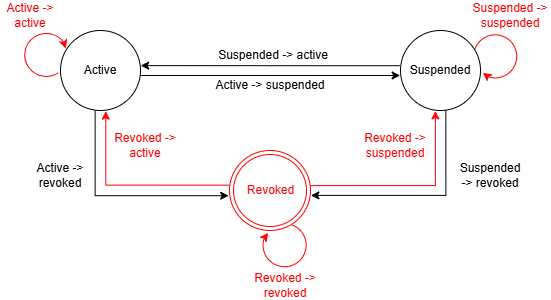

# Prepare Video Script and Demo Plan

Write a structured 10-minute video script

Structure: 
- Introduction
- Architecture walkthrough
- Live demo of main.py scenarios
- Testing and CI demonstration
- Conclusion / key design decisions

## Language used - Java
I chose to use Java for this project because it is a reliable and widely used programming language for building large backend projects. Java uses Object-Oriented Programming, which helps keep my code organised using classes and objects which makes the programme easier to manage as the project grows.

I decided not to use Python because, although it is simpler and quicker to write, it is more suited for smaller projects. Since Python is less strict in the structure and type hinting, it makes larger programmes harder to organise and maintain. For this project, I wanted yto use a language that encourages better organisation and long-term scalability, which is why Java is the better choice.

I also found that I have less experience in Java programming, therefore, this was the perfect opportunity to improve my knowledge in Java coding.

## State machine diagram

## Summary 
- architecture used
- what layers exist
- what each layer does
- separation of management and consumption
- which design patterns are used

The system follows a Layered Architecture consisting of presentation, service, domain, and infrastructure layers.

The service layer is divided into management and consumption components, directly reflecting the assessment requirement to separate write and read operations.

The domain layer contains core entities such as DigitalID, while the infrastructure layer implements data persistence using the Repository Pattern, separating business logic from storage.

The consumption layer applies the Facade Pattern through organisation-specific portals (e.g. BankPortal, TaxAuthorityPortal), providing simplified interfaces tailored to each organisation type.

Authorisation is implemented as a separate layer, enforcing access control before any service operation and demonstrating the Single Responsibility Principle.

A dedicated exception package provides domain-specific error handling, ensuring invalid operations are handled consistently and meaningfully across the system.